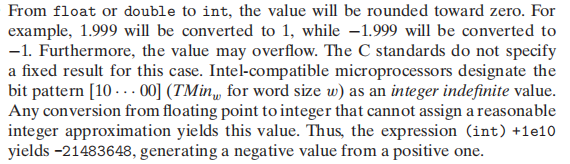

# Program structure and execution

## P84 Problem 2.5
A. Little endian : 0x78 Big endian : 0x12  
B. Little endian : 0x78 0x56 Big endian : 0x12 0x34  
C. Little endian : 0x78 0x56 0x34 Big endian : 0x12 0x34 0x56

## P85 Problem 2.6
A. 2607352 = 0x0027C8F8 = 00000000001**001111100100011111000**  
   3510593.0 = 0x4A1F23E0 = 010010100**001111100100011111000**00  
B. 21 bits match 
C. 

## P85 Problem 2.7
0x6D 0x6E 0x6F 0x70 0x71 0x72

## P87 Problem 2.8
| Operation | Result 
 --- | --- 
 a | [01001110]
 b | [11100001]
~a | [**10110001**]
~b | [**00011110**]
a&b | [**01000000**]
a\|b | [**11101111**]
a^b | 

## P161 int conversion of float and double
